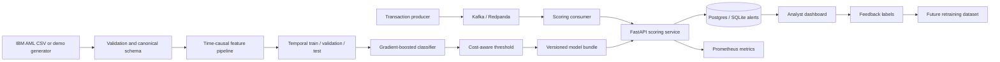

# AegisAML

**A production-oriented anti-money-laundering transaction monitoring platform.**

AegisAML turns IBM-style synthetic banking transactions into a reproducible pipeline for validation, time-causal feature engineering, cost-aware model training, real-time scoring, streaming alerts, analyst feedback, drift monitoring, and network investigation.

> This repository is an engineering reference and portfolio project. It is not a regulatory compliance product and must not be used as the sole basis for filing a suspicious-activity report or blocking a customer.

## Why this project is different

Most fraud projects end with a notebook and a high accuracy score. AegisAML includes the operational path around the model:

- IBM AML CSV schema ingestion and data-quality reporting
- Chronological train/validation/test splits
- Historical features computed strictly from prior transactions
- Local graph features such as prior pair count and unique counterparties
- Cost-aware threshold optimization with alert-capacity and recall constraints
- Versioned model bundle with an online feature-state snapshot
- FastAPI scoring, alert persistence, analyst feedback, and Prometheus metrics
- Kafka/Redpanda producer and consumer for transaction replay
- Offline account-network risk ranking with NetworkX
- PSI and categorical distribution drift reports
- Docker Compose, GitHub Actions, CodeQL, Dependabot, tests, and runbooks

## Architecture



See [docs/architecture.md](docs/architecture.md) for data flow, boundaries, scaling decisions, and failure modes.

## Quick start

Python 3.11–3.13 is supported.

```bash
python -m venv .venv
source .venv/bin/activate        # Windows: .venv\Scripts\activate
python -m pip install --upgrade pip
pip install -e ".[dev]"
make demo
make api
```

Open:

- API documentation: `http://localhost:8000/docs`
- Health endpoint: `http://localhost:8000/health`
- Prometheus endpoint: `http://localhost:8000/metrics`

Score a transaction:

```bash
curl -X POST http://localhost:8000/v1/score \
  -H 'Content-Type: application/json' \
  -d '{
    "transaction_id": "tx-10001",
    "timestamp": "2026-08-01T01:20:00Z",
    "from_bank": "B001",
    "from_account": "A0000100",
    "to_bank": "B019",
    "to_account": "A0000900",
    "amount_received": 9900,
    "receiving_currency": "USD",
    "amount_paid": 9900,
    "payment_currency": "USD",
    "payment_format": "Wire"
  }'
```

## Run with containers

```bash
docker compose up --build
```

The Compose stack bootstraps a demo model and starts:

| Component | Address |
|---|---|
| Scoring API | `localhost:8000` |
| Analyst dashboard | `localhost:8501` |
| Prometheus | `localhost:9090` |
| Redpanda external broker | `localhost:19092` |
| Postgres | internal Compose network |

Replay transactions after the stack becomes healthy:

```bash
python scripts/stream_producer.py \
  --data data/processed/transactions.csv \
  --bootstrap localhost:19092 \
  --rate 25
```

## Use the IBM AML transaction data

The improved IBM dataset is published separately. This repository does not commit or redistribute it.

```bash
pip install -e ".[data]"
export KAGGLE_USERNAME=...
export KAGGLE_KEY=...
python scripts/download_ibm_data.py --output data/raw/ibm
```

Then select a transaction CSV, for example a small or medium HI/LI file, and run:

```bash
python scripts/ingest_data.py \
  --input "data/raw/ibm/HI-Small_Trans.csv" \
  --output data/processed/ibm_hi_small.csv

python scripts/train_model.py \
  --data data/processed/ibm_hi_small.csv \
  --output models/ibm_hi_small.joblib \
  --report reports/ibm_hi_small_evaluation.json
```

For initial development, use a row limit or a smaller dataset variant. The local pandas implementation is designed for reproducibility and service parity. See the scaling section in [docs/architecture.md](docs/architecture.md) before processing the largest files.

## Repository map

```text
src/aegis_aml/
├── api/             FastAPI schemas, lifecycle, routes, and scoring service
├── data/            IBM schema contracts, validation, ingestion, demo generation
├── features/        Time-causal transaction features and graph investigation
├── modeling/        Training, threshold selection, evaluation, model bundles
├── monitoring/      Prometheus metrics and distribution-drift checks
├── persistence/     SQLAlchemy alert and analyst-feedback storage
└── streaming/       Kafka/Redpanda producer and scoring consumer

scripts/             Thin command-line entry points
docs/                Architecture, API, script, source, model, and runbook guides
configs/             Environment-specific YAML settings
infra/               Prometheus and future observability provisioning
tests/               Unit, integration, and API-oriented tests
```

Detailed module and function descriptions are in [docs/source-code-guide.md](docs/source-code-guide.md). Script-by-script usage is in [docs/scripts.md](docs/scripts.md).

## Model design

The baseline is a histogram gradient-boosting classifier. Categorical values are ordinal-encoded with an explicit unknown category. The baseline deliberately avoids oversampling because synthetic observations can distort temporal and network behavior. Class imbalance is handled with balanced class weights.

Historical features include sender and receiver activity counts, prior average amounts, time since prior activity, previous sender–receiver interactions, and prior unique counterparties. They are calculated before the current row is incorporated into state.

The alert threshold is selected on the validation period by minimizing:

```text
false_positives × false_positive_cost + false_negatives × false_negative_cost
```

subject to configured recall and maximum alert-rate constraints. Evaluation is then performed once on the final chronological test period.

## Testing and quality

```bash
make test
make lint
pre-commit install
```

CI runs tests across supported Python versions, static linting, a container build, and CodeQL analysis. Generated data, reports, databases, and model binaries are intentionally ignored by Git.

## Documentation

- [Documentation index](docs/index.md)
- [Architecture](docs/architecture.md)
- [Data contract and IBM dataset setup](docs/data.md)
- [Scripts and commands](docs/scripts.md)
- [Source-code and function guide](docs/source-code-guide.md)
- [API reference](docs/api.md)
- [Model card](docs/model-card.md)
- [Operations runbook](docs/operations-runbook.md)
- [Production hardening roadmap](docs/roadmap.md)
- [References and attribution](docs/references.md)
- [Validation record](docs/validation.md)

## License and data notice

AegisAML code is licensed under Apache-2.0. The IBM AML dataset is obtained separately and has its own license. Review [NOTICE](NOTICE) and the publisher's terms before use.
